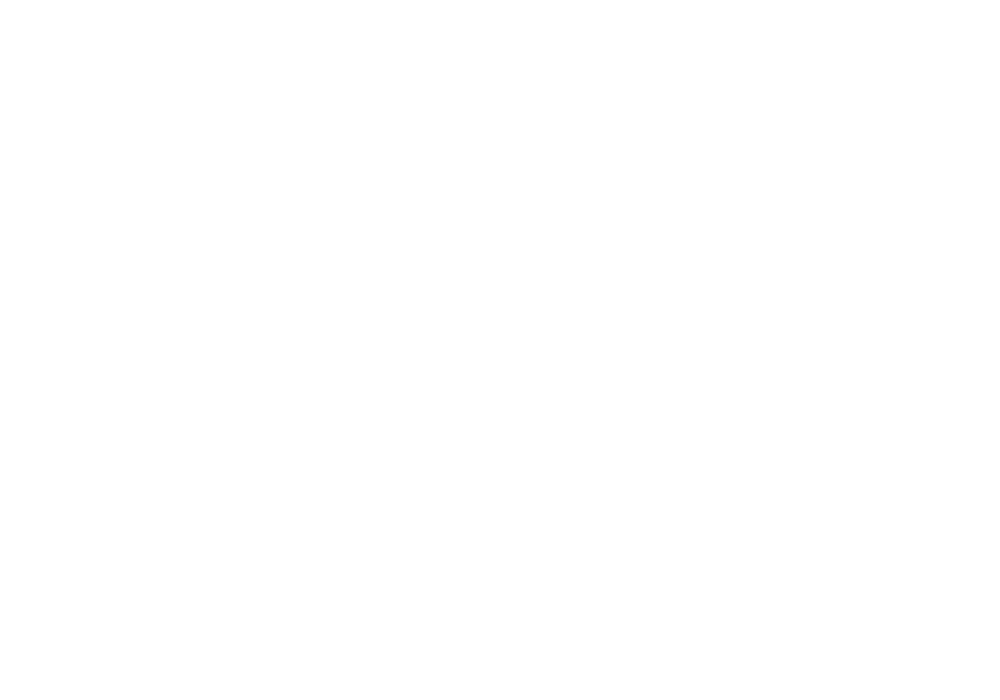
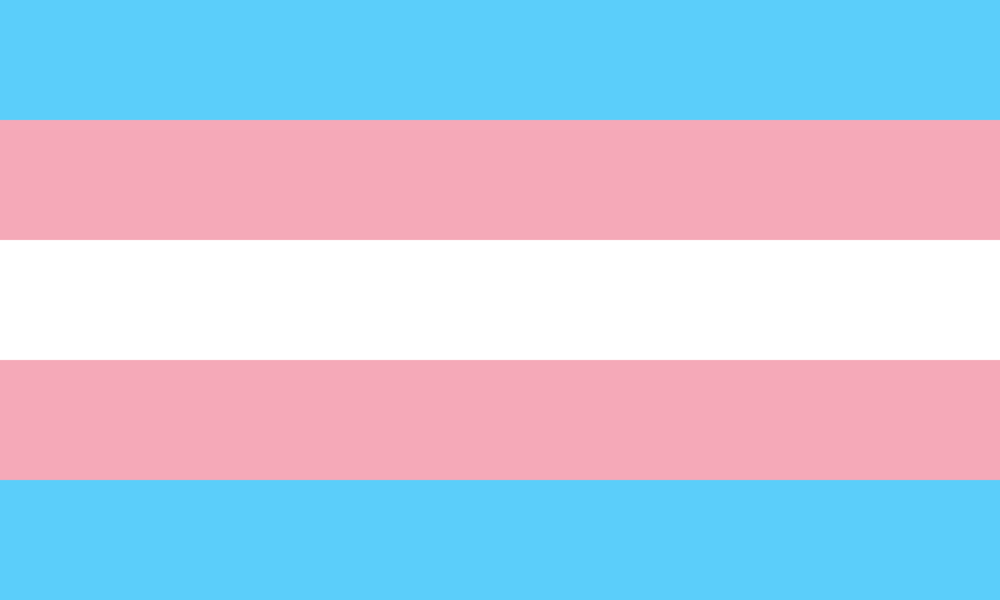
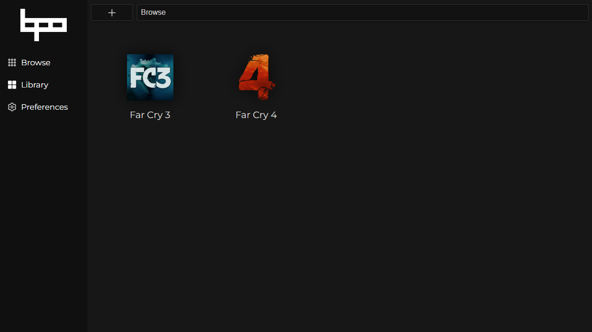

 

 

  

Black Pearl Origin is a fork of the Project Black Pearl, founded and maintained by the former PBP lead developers. It was forked due to a fallout with one of the owners in PBP.

## What is Black Pearl Origin?

**Black Pearl Origin** (or BPO) is a [FOSS](https://en.wikipedia.org/wiki/Free_and_open-source_software) project that aims to unify game sources in one place by utilizing extensions made by the community. It is aimed to provide a convenient way of dealing with games sourced from all sorts of websites and provides a store system powered by a powerful extension ecosystem.

## What is the current state of the project?

BPO is currently in beta. You can check [the to-do list](https://github.com/orgs/BlackPearlOrigin/projects/4/views/1) to see what features are planned or currently in development.

## How can I contribute?

We welcome any contributions to the project, be it code, translations, or just general feedback. You can check out the [CONTRIBUTING.md](./CONTRIBUTING.md) file for more information on how to contribute via code.
Please remember that translations are managed differently than code contributions as mentioned below.

## Translations

Black Pearl Origin supports full localization. Instructions to help translate the project can be found in [LOCALIZATION.md](./LOCALIZATION.md).

## Support

You are always welcome to join our [Discord](https://discord.gg/WpBr3hJVf5) server to get help or just to hang out with us!

## Credit

Special thanks to the developers of the [Stremio Addon SDK](https://github.com/Stremio/stremio-addon-sdk) for allowing us to use their code as a base for our Plugin SDK.
